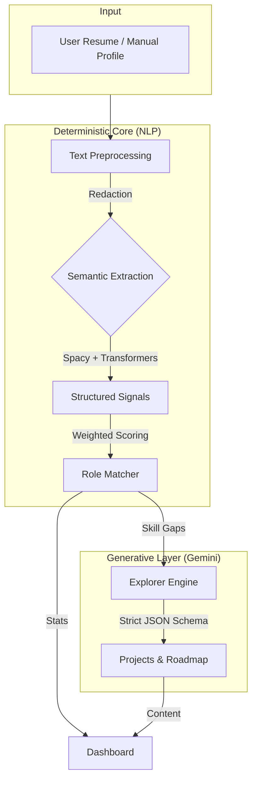

# Career Compass (Career Architect v7.0)

**A Deterministic NLP-First Career Decision Support System with Generative Strategy**

---

## 📌 Project Overview

**Career Compass** is a high-fidelity Career Strategy OS that merges **Deterministic NLP** (for accurate skill extraction) with **Generative AI** (for strategic creativity).

Unlike basic wrappers, this system uses a "Sandwich Architecture":
1.  **Input**: Resume / Manual Profile
2.  **Core (NLP)**: Strict, evidence-based skill extraction & scoring (SpaCy, Transformers)
3.  **Synthesis (GenAI)**: Creative roadmap & project generation (Gemini 3 Flash)

---

## 🚀 Key Features

### 1. 🧠 Deterministic NLP Engine
-   **Semantic Extraction**: Uses `sentence-transformers` to map variation (e.g., "React.js" -> "React") to canonical skills.
-   **Viva-Defensible Scoring**: Every score (Role Fit, Skill Confidence) provides a mathematical breakdown.
-   **Negation Handling**: Context-aware parsing rejects negative signals ("No experience in Java").

### 2. ⚡ Generative Explorer (Gemini 3 Flash)
-   **Strict Schema Validation**: All LLM outputs are forced into strict JSON schemas.
-   **Project Recommender**: Suggests concrete, resume-building projects based on skill gaps.
-   **Nearby Interactions**: Identifies adjacent fields you are strictly 1 step away from mastering.

### 3. 🛡️ Enterprise-Grade Reliability
-   **Automatic Key Rotation**: Smartly cycles through multiple API Keys (`GEMINI_API_KEY`, `_2`, `_3`, `_4`) to bypass Quota limits.
-   **Local Caching**: `role_baselines.json` caches common roles to save API calls.
-   **Cyberpunk UI**: Custom CSS animations for a premium, responsive experience.

---

## 🛠️ Installation & Usage

1.  **Clone the Repository**
    ```bash
    git clone https://github.com/TheClazer/NLP-career-guidance.git
    cd NLP-career-guidance
    ```

2.  **Install Dependencies**
    ```bash
    pip install -r requirements.txt
    python -m spacy download en_core_web_sm
    ```

3.  **Configure Environment**
    Create a `.env` file:
    ```env
    # Primary Key
    GEMINI_API_KEY=your_key_here
    
    # Optional Backup Keys for Rotation (Unique Projects Recommended)
    GEMINI_API_KEY_2=your_key_2
    GEMINI_API_KEY_3=your_key_3
    
    # Model Configuration
    LLM_MODEL=gemini-3-flash-preview
    ```

4.  **Run the Experience**
    ```bash
    streamlit run app.py
    ```

---

## 🏗️ System Architecture

### Logical Flow (The "Sandwich" Architecture)
The system creates a deterministic bridge between raw text and generative insights.



### Physical Implementation (Code Structure)
How the logical architecture maps to files:

```
career-nlp/
├── app.py                          # 🎮 Main Orchestrator (Streamlit)
├── config.py                       # ⚙️ Settings & Env Mgt
├── .env                            # 🔑 API Keys (GitIgnored)
│
├── nlp/                            # [Determinstic Layer]
│   ├── nlp_engine.py               # Spacy Pipeline & Confidence Logic
│   └── ...
│
├── intelligence/                   # [Logic Layer]
│   ├── role_matcher.py             # Math-based Scoring & Weights
│   └── ontology.py                 # Skill Normalization
│
├── ai_core/                        # [Generative Layer]
│   ├── explorer.py                 # Interest/Project/Opp Synthesis
│   └── synthesis.py                # Roadmap Generation
│
├── utils/                          # [Infrastructure]
│   ├── ai_bridge.py                # Key Rotation & LLM Client
│   └── text_utils.py               # Cleaners
│
└── data/                           # [Cache]
    └── role_baselines.json         # Weighted role definitions
```

---

## ⚠️ Quota Management (Free Tier)
Google's Gemini Free Tier has strictly enforced rate limits.
-   **Symptom**: `429 Quota Exceeded` errors.
-   **Solution**: The system supports **Multi-Project Key Rotation**.
    -   Create keys in **different** Google Cloud Projects to get separate quotas.
    -   Add them as `GEMINI_API_KEY_2`, `_3`, etc.
    -   The system will auto-switch when one hits a limit.

---

**Built by Rayyan Shaikh** | Powered by Gemini 3 Flash & Semantic Search

---

## 📌 Project Overview

Career Architect Elite OS is a **viva-defensible Decision Support System (DSS)** built using deterministic Natural Language Processing (NLP) with semantic normalization, not a chatbot.

Unlike typical AI systems that rely on probabilistic text generation, this platform **extracts structured linguistic signals** from resumes and career narratives, then applies **explainable mathematical scoring** to produce:

* Objective skill graphs with evidence traces
* Role-fit scores with full decomposition
* Skill gap analysis with severity levels
* Actionable career roadmaps (LLM-synthesized from structured data)

---

## 🎯 Problem Statement

Students and early-career professionals face:

> "I don't know what I'm actually good at, what role fits me, or what exactly I should do next."

Most tools give generic advice with no explainability. Career Architect solves this through **deterministic signal extraction** and **transparent scoring**.

---

## 🚀 Why Not Just ChatGPT?

| Aspect | ChatGPT | Career Architect |
| :--- | :--- | :--- |
| **Architecture** | Stateless chatbot | Stateful DSS |
| **NLP** | Implicit | Explicit (NER, semantic normalization) |
| **Skill Extraction** | Hallucinated | Deterministic + negation-aware |
| **Scoring** | None | Mathematical with full decomposition |
| **Explainability** | Weak | Every score breaks down numerically |
| **Validation** | No | JSON schema + sanity checks |

---

## 🧠 Core NLP Architecture (The "How")

### 1️⃣ Semantic Skill Extraction (Three-Layer)

**NOT string matching. Deterministic semantic normalization.**

#### Layer A: Linguistic Candidate Extraction (spaCy)
- Noun chunks + verb phrases
- Lemmatization
- Proximity to action verbs (`built`, `designed`, `implemented`)
- Stop-phrase filtering (`interested in`, `learning`)

#### Layer B: Negation & Context Filtering
**Critical for viva defense:**
- spaCy dependency parsing detects negation
- Rejects: "No experience in Java" → Java discarded
- Rejects: "Never used Python" → Python discarded

#### Layer C: Semantic Normalization (Embeddings)
- `sentence-transformers/all-MiniLM-L6-v2` (90MB, cached)
- Cosine similarity ≥ 0.75 for match
- Maps user language → canonical skill names
- Example: "Django framework" → "Python" (if similar enough)

**Output:** Structured objects with full traceability
```json
{
  "skill": "Python",
  "confidence": 0.87,
  "evidence": ["built REST APIs", "automation scripts"],
  "depth": "applied"
}
```

---

### 2️⃣ Confidence & Language Signal (Weighted Formula)

**NOT word counting. Sentence-level linguistic classification.**

#### Formula (Viva-Defensible)
```
Confidence = (Action_Verbs × 1.5 - Hedge_Words) / Total_Sentences
```

Normalized to [0, 1].

- **Action verbs** (`built`, `deployed`): +1.5
- **Passive voice** (`was implemented`): +0.5
- **Hedging** (`familiar with`, `basic`): -1.0

**Output:** Per-sentence trace for explainability
```json
{
  "sentence": "Built scalable APIs using Python...",
  "classification": "assertive",
  "action_verbs": 2,
  "hedge_markers": 0,
  "score": 1.5
}
```

---

### 3️⃣ Role Matching (Skill Tiers + Penalties)

**All weights in `role_baselines.json`. No magic numbers.**

#### Structure
```json
{
  "core_skills": ["Python", "SQL"],      // Must-have
  "secondary_skills": ["Docker"],        // Important
  "optional_skills": ["Redis"],          // Nice-to-have
  "weights": {"Python": 5, "SQL": 4, "Docker": 3, "Redis": 2},
  "core_penalty": 0.3                    // Penalty per missing core skill
}
```

#### Scoring Formula
```
Skill_Score = (Earned_Weight / Total_Weight) - (Missing_Core × Penalty)
Final_Score = (Skill_Score × 0.7) + (Confidence × 0.3)
```

**Output:** Full decomposition
```json
{
  "score": 71.2,
  "skill_score": 62.0,
  "language_score": 78.0,
  "penalties": ["Missing 2 core skills: SQL, System Design"],
  "breakdown": {
    "core_matched": 1,
    "core_total": 3,
    "earned_weight": 15,
    "total_weight": 24
  }
}
```

---

## 📁 System Architecture

```
User Resume / Text
        ↓
[1] Text Preprocessing (PII redaction)
        ↓
[2] Semantic Skill Extraction (3-layer)
        ↓
[3] Confidence Analysis (weighted formula)
        ↓
[4] Skill Normalization (ontology mapping)
        ↓
[5] Role Matching (tier-based scoring)
        ↓
[6] Gap Analysis (severity classification)
        ↓
[7] LLM Synthesis (roadmap generation ONLY)
        ↓
Dashboard + Graphs
```

---

## 🔬 LLM Usage (Strictly Sandboxed)

**LLMs NEVER:**
- Extract skills
- Compute scores
- Make decisions

**LLMs ONLY:**
- Explain results (from structured data)
- Generate roadmaps (from JSON gaps)
- Suggest project ideas

**All LLM outputs:**
- JSON schema validated
- Sanity checked (weights 1-5, etc.)
- Graceful degradation on failure

---

## 🛠️ Installation & Usage

```bash
# Install dependencies
pip install -r requirements.txt

# Download spaCy model
python -m spacy download en_core_web_sm

# Run application
streamlit run app.py
```

**Environment Variables:**
```
GEMINI_API_KEY=your_api_key_here
LLM_MODEL=gemini-3-pro-review
```

---

## 🧪 Testing & Evaluation

### Unit Tests
```bash
# Test semantic extraction with negation handling
python -m unittest tests/test_semantic_extraction.py

# Test role matcher decomposition
python -m unittest tests/test_role_matcher.py

# Run all tests
python -m unittest discover -s tests
```

### Evaluation Pipeline
```bash
python scripts/eval_pipeline.py
```

**Metrics:**
- Skill extraction recall > 50%
- Negation handling (no false positives)
- Role rank stability under noise

---

## ⚠️ Known Limitations (Explicitly Documented)

1. **Ontology Size**: Current skill database covers ~100 canonical terms (expandable to O*NET scale)
2. **Embedding Threshold**: 0.75 cosine similarity may miss edge cases (tunable)
3. **Confidence Heuristic**: Linguistic analysis, not psychological assessment
4. **No Hiring Outcomes**: Scores based on industry baselines, not trained on hiring data
5. **Rule-Based Roadmaps**: Progression is deterministic, not probabilistic

**These are features, not bugs.** The system prioritizes explainability over coverage.

---

## 📊 Folder Structure

```
career-architect/
├── app.py                          # Streamlit orchestrator
├── config.py                       # Global configuration
├── requirements.txt
│
├── nlp/                            # Deterministic NLP layer
│   ├── skill_extractor.py          # 3-layer semantic extraction
│   ├── confidence.py               # Weighted scoring
│   ├── preprocess.py               # PII redaction
│   └── nlp_engine.py               # Pipeline orchestrator
│
├── intelligence/                   # Deterministic scoring
│   ├── role_matcher.py             # Tier-based matching
│   ├── ontology.py                 # Skill normalization
│   ├── weakness_detector.py        # Resume audit
│   └── sanity.py                   # Safety checks
│
├── llm/                            # Sandboxed LLM layer
│   ├── llm_client.py               # Schema-validated calls
│   └── synthesis.py                # Roadmap generation
│
├── data/
│   ├── skill_ontology.json         # Canonical skill mappings
│   ├── role_baselines.json         # Role definitions with tiers
│   └── demo_profiles.json          # Evaluation dataset
│
├── schemas/                        # JSON validation schemas
│   ├── role_baseline.schema.json
│   └── roadmap.schema.json
│
├── tests/                          # Unit tests
│   ├── test_semantic_extraction.py
│   ├── test_role_matcher.py
│   └── test_weakness_detector.py
│
└── scripts/
    └── eval_pipeline.py            # Metrics computation
```

---

## 🎓 Viva-Ready One-Line Explanation

> "This system uses deterministic NLP with semantic embeddings to extract verifiable skill signals from text, applies transparent mathematical scoring with full decomposition, and uses LLMs only for bounded synthesis—proving that responsible AI requires determinism before generation."

---

## 📈 Future Enhancements

* O*NET ontology integration (23,000+ skills)
* Resume chunking for >10-page documents
* Multi-lingual support (embeddings already multilingual)
* A/B testing for role recommendations
* Peer benchmarking dashboard

---

## ✅ Design Principles

Career Architect demonstrates that **production AI systems** require:

1. **NLP before LLM** — Extract structured signals first
2. **Determinism before generation** — No opaque model decisions
3. **Explainability before confidence** — Every score must decompose
4. **Validation before deployment** — Schema checks and sanity tests

This project prioritizes **correctness, clarity, and viva-defensibility** over hype.

---

**Build Version:** Elite OS 6.2  
**Model:** Gemini 3 Pro Review  
**License:** Academic/Research Use

---
